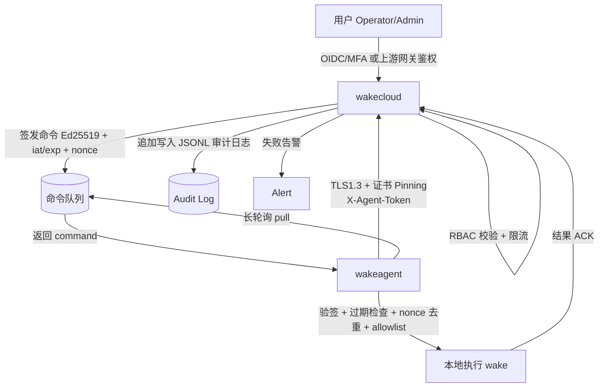

# WakeOnLanGo

一个基于 Go 的局域网唤醒服务，内置 H5 页面，可直接查看设备、发送 Wake-on-LAN 魔术包，并在网页上维护设备配置。

`curl` 一键安装并启用开机自启：

```bash
curl -fsSL https://raw.githubusercontent.com/gofxq/wakeonlango/master/scripts/deploy.sh | bash -s -- enable
```


.png>)

## 功能

- 设备列表展示与一键唤醒
- 管理员口令保护的设备增删改
- 页面标题、默认唤醒端口、管理员口令在线修改
- 配置持久化到本地 JSON 文件，保存后立即生效
- 访问日志、鉴权失败日志、设备与配置变更日志
- 支持按 CIDR 扫描同网段在线设备并提取 MAC 地址候选
- 单二进制部署，无第三方依赖

## 目录

- `cmd/wakego`: 程序入口
- `internal/config`: 配置加载、校验、原子写入
- `internal/wol`: WOL 魔术包组装与发送
- `internal/applog`: 日志输出与文件落盘
- `internal/server`: HTTP 路由与页面渲染
- `internal/server/web/index.html`: 内置 H5 页面
- `scripts/deploy.sh`: 一键部署脚本

## 启动

```bash
go run ./cmd/wakego -addr :8080 -config ./config.json
```

首次启动时如果 `config.json` 不存在，会自动生成默认配置。

如果需要把日志落盘：

```bash
go run ./cmd/wakego -addr :9090 -config ./config.json -log-file ./logs/wakego.log
```

## 构建

```bash
go build -o wakego ./cmd/wakego
```

## 自动发布

仓库在 `master` 分支每次有新提交时，会触发 [release.yml](./.github/workflows/release.yml)：

- 先执行 `go test ./...`
- 再构建 `linux/darwin/windows` 的 `amd64/arm64` 二进制
- 最后自动创建一个新的 GitHub Release，并上传对应平台压缩包

Release 标签格式默认是 `v0.0.<GitHub Run Number>`。

## 一键部署

部署脚本现在会先从 GitHub Release 下载当前机器对应的二进制。你可以手动 `start`，也可以用 `enable` 安装成开机自启服务。

如果当前目录是这个仓库的 Git clone，脚本会复用当前目录；否则默认安装到 `~/wakego`，默认仓库是 `gofxq/wakeonlango`。

```bash
./scripts/deploy.sh enable
```


常用命令：

- `./scripts/deploy.sh install`
- `./scripts/deploy.sh start`
- `./scripts/deploy.sh stop`
- `./scripts/deploy.sh restart`
- `./scripts/deploy.sh update`
- `./scripts/deploy.sh enable`
- `./scripts/deploy.sh disable`
- `./scripts/deploy.sh status`
- `./scripts/deploy.sh logs`

如需部署指定版本，可以传 `VERSION`：

```bash
VERSION=v0.0.12 ./scripts/deploy.sh install
```

如需修改端口或安装目录，可以临时覆盖环境变量：

```bash
APP_HOME=~/wakego-test ADDR=:8088 ./scripts/deploy.sh restart
```

说明：

- Linux 下优先安装 `systemd` 服务
- macOS 下优先安装 `launchd`
- 非 root 用户在 Linux 上会安装 user-level `systemd` 服务；若希望重启后未登录也自动运行，需执行 `sudo loginctl enable-linger $USER`
- 非 root 用户在 macOS 上会安装 `LaunchAgent`，它会在用户登录后自动拉起；若需要系统级开机启动，请使用 `sudo`

## 配置文件

配置文件路径通过 `-config` 指定，格式示例见 [config.example.json](./config.example.json)。

字段说明：

- `title`: 页面标题
- `admin_password`: 管理员口令
- `default_port`: 新设备默认 WOL 端口
- `devices`: 设备列表

## 管理方式

1. 打开首页，点击“管理员入口”
2. 输入管理员口令
3. 读取并修改基础配置或设备配置
4. 保存后立即写入本地 JSON 文件

管理接口使用请求头 `X-Admin-Password` 校验，建议仅在内网或 HTTPS 反向代理后暴露。

## API

- `GET /`: H5 页面
- `GET /api/devices`: 获取设备列表
- `POST /api/wake`: 发送唤醒请求，Body: `{"id":"pc-1"}`
- `GET /api/admin/config`: 读取配置，需要管理员口令
- `POST /api/admin/config/save`: 保存基础配置
- `POST /api/admin/device/save`: 新增或更新设备
- `POST /api/admin/device/delete`: 删除设备
- `POST /api/admin/scan`: 扫描指定 CIDR 网段内当前可发现的设备

`/api/admin/scan` 请求示例：

```json
{
  "cidr": "192.168.1.0/24"
}
```

说明：

- 仅支持 IPv4 CIDR
- 仅适合同网段扫描
- 扫描结果来自轻量探测后的 ARP/邻居表，不保证包含所有关机设备
- 单次扫描限制为最多 `1024` 个地址

## 部署建议

- 建议绑定在内网地址或放在反向代理后
- 调试阶段可以直接使用 `9090` 端口
- 若跨网段唤醒，需确认路由器支持定向广播
- 目标主机需提前启用 BIOS/UEFI、网卡驱动和交换机相关的 WOL 配置

## 远程安全控制（wakecloud + wakeagent）

本仓库新增了两个可执行程序：

- `cmd/wakecloud`: 公网远程控制服务端（TLS、命令签名、RBAC、限流、审计追加日志）
- `cmd/wakeagent`: 本地 Agent（TLS 证书固定 pinning、命令验签、60 秒过期校验、nonce 防重放、本地白名单执行）

### 交互流程图



### 安全基线对应关系

- TLS 1.3 + 证书固定（Agent 通过 `pinned_server_cert_sha256` 校验）
- 设备身份（`X-Agent-Token`，可选 mTLS）
- 命令 Ed25519 签名 + 60 秒过期 + nonce 去重
- RBAC（`viewer/operator/admin`）
- 速率限制（用户、Agent、IP 三层固定窗口）
- 审计日志追加写入（JSON Lines）
- 异常告警日志（重复 nonce、签名失败、执行失败）

> 当前版本先提供可执行安全骨架。用户侧 OIDC + MFA 建议放在反向代理或 API Gateway（如 Authelia/Keycloak/Cloudflare Access）层接入。

### 1) 准备密钥与证书

生成 Ed25519 密钥（base64）：

```bash
go run ./scripts/gen_ed25519.go
```

生成 TLS 证书后，获取服务端证书 pin（SHA256 of DER）：

```bash
openssl x509 -in certs/server.crt -outform DER | sha256sum
```

### 2) 启动远程服务端

参考 `cloud-config.example.json` 生成 `cloud-config.json`：

```bash
go run ./cmd/wakecloud -config ./cloud-config.json
```

关键 API：

- `POST /api/v1/commands`（operator/admin 下发 wake 命令）
- `GET /api/v1/agent/pull?agent_id=...`（agent 长轮询拉取）
- `POST /api/v1/agent/ack`（agent 上报执行结果）
- `GET /api/v1/commands/ack?command_id=...`（查看回执）

### 3) 启动本地 Agent

参考 `agent-config.example.json` 生成 `agent-config.json`：

```bash
go run ./cmd/wakeagent -agent-config ./agent-config.json -config ./config.json
```

Agent 只会执行 `allowed_device_ids` 中的设备唤醒，且必须通过签名、过期时间、nonce 校验。
